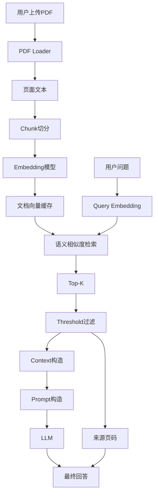
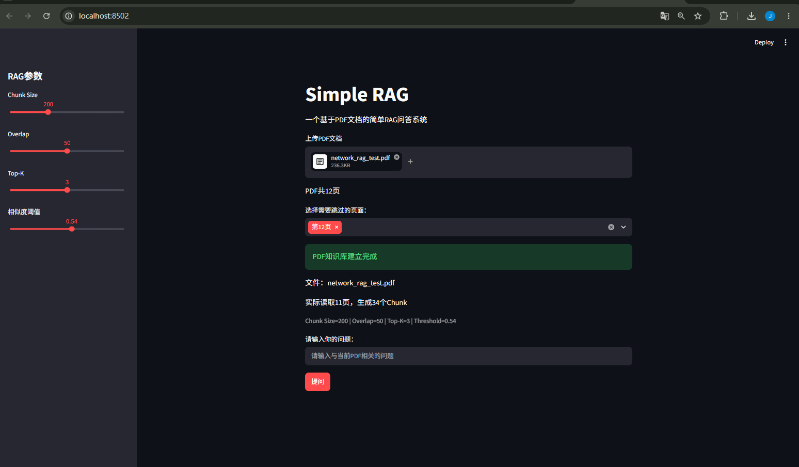
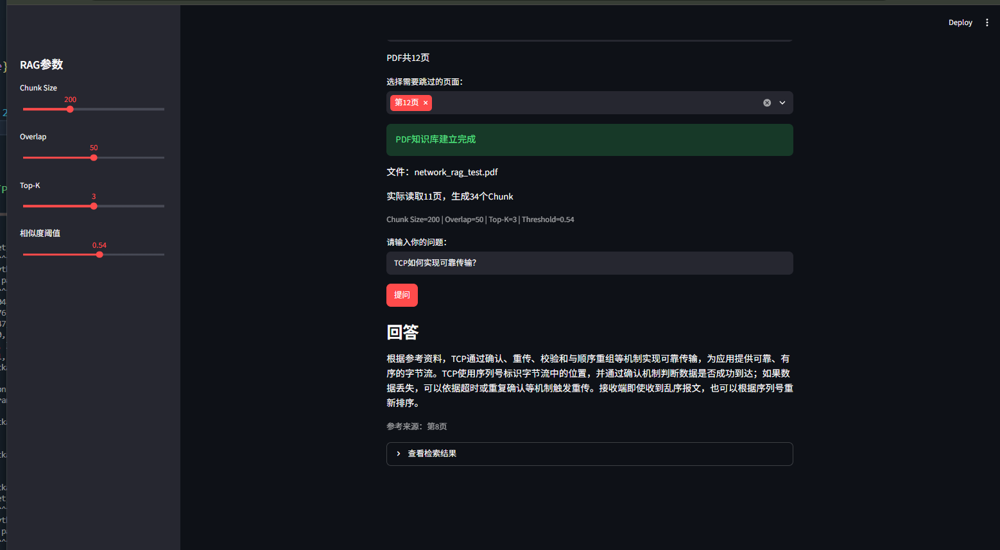
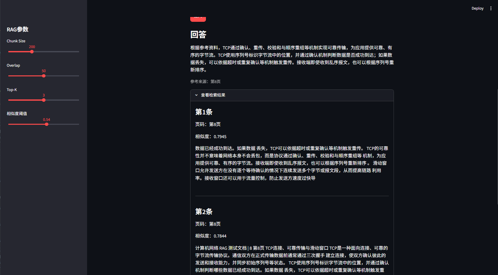

# Simple RAG

一个从零实现的轻量级PDF RAG问答系统，用于学习 RAG 基本原理（Just for practice.XD）
本项目不直接使用LangChain等RAG框架封装，而是将PDF解析、文本切块、Embedding、语义检索、Prompt构造和大语言模型调用等步骤逐步实现，并针对Retriever性能和Chunk参数进行了初步实验。

目前项目支持Web端上传PDF、页面过滤、RAG参数调整、来源页码展示以及Retriever检索结果查看。

---
## 项目流程

### 1.从基础组件实现完整RAG流程

```text
PDF解析
↓
Chunk切分
↓
Embedding
↓
Retriever
↓
Top-K
↓
Threshold
↓
Context
↓
Prompt
↓
LLM
↓
Answer
```
通过这种方式理解RAG系统中各阶段的具体作用。

### 2.支持可溯源PDF问答

Retriever会保留每个Chunk对应的原始PDF页码。

最终回答不仅能够展示答案，还可以显示：

```text
参考来源：第5页
```

同时支持展开查看实际检索到的Chunk、相似度和来源页码。

### 3.支持上传任意PDF

Web界面支持上传PDF文档，并自动完成：

```text
PDF上传
↓
文本提取
↓
Chunk切分
↓
Embedding
↓
建立知识库
↓
开始问答
```

不同PDF会使用不同的缓存目录，避免文档向量混用。

### 4.支持PDF页面过滤

用户可以在Web界面中选择需要跳过的页面，例如封面、目录或其他与正文无关的页面。

被跳过的页面不会参与Embedding和语义检索，但其余页面仍然保留PDF原始页码，保证来源溯源正确。

### 5.支持动态调整RAG参数

Web端支持调整：

- Chunk Size
- Overlap
- Top-K
- Similarity Threshold

可以直接观察不同参数对Retriever结果和Chunk数量的影响。

### 6.包含Retriever自动评测

项目建立了人工标注测试集，可以自动计算：

```text
Top-1命中率
Top-3命中率
平均检索时间
```

并用于比较不同Chunk Size参数下的检索效果。

---

## 系统架构



---

## 当前功能

目前已经实现：

- PDF文本读取
- PDF原始页码保留
- 用户自定义跳过页面
- 固定长度Chunk切分
- Chunk Overlap
- 中文Embedding
- Top-K语义检索
- Similarity Threshold过滤
- 文档Embedding本地缓存
- Embedding模型本地优先加载
- Prompt构造
- LLM调用
- 最终答案来源页码展示
- Retriever检索结果展示
- 连续问答
- Streamlit Web界面
- Web端PDF上传
- Web端动态调整RAG参数
- Retriever自动评测
- Chunk Size参数实验
- 系统性能统计

---

## 当前配置

当前默认参数：

```text
Chunk Size=200
Overlap=50
Top-K=3
Threshold=0.54
```

当前Embedding模型：

```text
BAAI/bge-small-zh-v1.5
```

---

## 项目结构

```text
simple_rag/
│
├── data/
│   └── knowledge.pdf
│
├── evaluation/
│   └── test_questions.json
│
├── assets/
│   ├── web_main.png
│   ├── web_answer.png
│   ├── retrieval_result.png
│   ├── 2026_8_22_18_33.png
│   └── 2026_8_22_18_35.png
│
├── loader.py
├── chunker.py
├── retriever.py
├── prompt.py
├── llm.py
├── config.py
│
├── main.py
├── app.py
├── evaluate.py
│
├── experiments.md
├── requirements.txt
├── .env.example
├── .gitignore
└── README.md
```

各模块职责：

```text
loader.py
→读取PDF并保留页码

chunker.py
→文本切块

retriever.py
→Embedding、Top-K检索、Threshold过滤和向量缓存

prompt.py
→构造RAG Prompt

llm.py
→调用大语言模型

config.py
→统一管理项目默认参数

main.py
→命令行RAG问答流程

app.py
→Streamlit Web界面

evaluate.py
→Retriever自动评测
```

---

## 安装与运行

### 1.克隆项目

```bash
git clone <your_repository_url>
cd simple_rag
```

### 2.创建虚拟环境

```bash
python -m venv .venv
```

Windows PowerShell：

```bash
.\.venv\Scripts\Activate.ps1
```

### 3.安装依赖

```bash
pip install -r requirements.txt
```

### 4.配置API Key

将：

```text
.env.example
```

复制为：

```text
.env
```

然后填写：

```text
DEEPSEEK_API_KEY=your_api_key_here
```

`.env`已加入`.gitignore`，不会上传到GitHub。

---

## 命令行运行

```bash
python main.py
```

程序初始化完成后可以连续提问：

```text
请输入你的问题：
Cache利用了什么原理？

===== RAG最终回答 =====
Cache利用的是程序访问的局部性原理，包括时间局部性和空间局部性。

参考来源：
第2页
```

输入：

```text
exit
```

即可退出。

---

## Web界面运行

运行：

```bash
python -m streamlit run app.py
```

浏览器会打开Streamlit界面。

Web端支持：

```text
上传PDF
↓
选择需要跳过的页面
↓
调整RAG参数
↓
建立知识库
↓
输入问题
↓
查看最终答案
↓
查看来源页码
↓
展开Retriever结果
```

---

## Web Demo

### PDF上传与参数配置



### RAG问答结果



### Retriever检索结果



---

## Embedding模型加载策略

项目首先尝试从本地加载Embedding模型：

```text
本地存在模型
↓
直接加载
↓
避免Hugging Face网络访问
```

如果新环境中没有对应模型：

```text
本地未找到模型
↓
自动连接Hugging Face Hub
↓
下载模型
↓
保存到本地缓存
```

这样既可以避免已有模型时不必要的网络访问，又保证项目在新环境中能够运行。

## 文档Embedding缓存

首次处理PDF时：

```text
PDF
↓
Chunk
↓
Embedding
↓
保存文档向量
```

之后再次处理相同PDF和相同Chunk参数时，可以直接读取本地文档向量。

不同PDF会通过文件Hash区分缓存目录。

不同Chunk Size和Overlap参数也会使用独立缓存，避免错误复用旧向量。

---

## 性能实验

初始版本中，Retriever初始化曾需要约11～13s，并且受到Hugging Face网络访问影响，极端情况下甚至达到数十秒。

通过分析发现，主要波动来自Embedding模型加载时的网络访问。

改为本地优先加载后，连续3次测试结果为：

| 测试 | Embedding模型加载 | Retriever初始化 | 系统启动 |
| ---: | ---: | ---: | ---: |
| 1 | 0.1312s | 0.1321s | 0.1602s |
| 2 | 0.1330s | 0.1341s | 0.1596s |
| 3 | 0.1324s | 0.1333s | 0.1591s |

说明在模型和文档向量均已缓存的情况下，系统启动时间可以稳定在约0.16s。

在连续问答实验中，语义检索通常只需要约0.006～0.009s，单次问答主要耗时来自LLM调用。

详细实验过程见：

```text
experiments.md
```

---

## Retriever自动评测

目前建立了包含15个问题的小型人工标注测试集，覆盖：

- Cache
- RISC-V
- 虚拟内存与TLB
- 指令流水线
- 哈夫曼编码

在当前`Chunk Size=200`、`Overlap=50`配置下：

```text
Top-1命中率：15/15（100%）
Top-3命中率：15/15（100%）
```

当前测试集规模仍然较小，因此该结果主要用于验证Retriever基本能力，并不能代表系统在大型知识库中的实际性能。

---

## Chunk Size实验

固定`Overlap=50`，分别测试不同Chunk Size：

| Chunk Size | Chunk数量 | Top-1 | Top-3 | 平均检索时间 |
| ---: | ---: | ---: | ---: | ---: |
| 100 | 24 | 100.0% | 100.0% | 0.005903s |
| 200 | 11 | 100.0% | 100.0% | 0.005633s |
| 300 | 6 | 93.3% | 100.0% | 0.005957s |

当`Chunk Size=300`时出现一次Top-1未命中，但正确结果仍位于Top-3中。

初步说明：

- Chunk过大可能混入更多语义，影响具体问题的Top-1排序。
- Chunk过小会产生更多向量，增加索引规模。
- Top-K检索能够一定程度上缓解Top-1排序不稳定的问题。

因此当前暂时采用：

```text
Chunk Size=200
Overlap=50
Top-K=3
```

详细实验过程见`experiments.md`。

---

## 当前存在的问题

目前项目仍存在以下局限：

- 当前自动评测集只有15个问题
- 测试知识库规模仍然较小
- Similarity Threshold仍然需要人工设定
- 相邻Chunk可能由于Overlap产生重复内容
- 当前使用简单向量相似度排序，没有加入Reranker
- 尚未针对大型PDF知识库测试检索性能
- 扫描型PDF目前无法直接处理
- 当前页面过滤依赖用户手动选择
- Web界面仍然较为基础

---

## 后续计划

后续可以继续尝试：

- [ ] 扩大Retriever自动评测集
- [ ] 使用更大规模PDF知识库进行测试
- [ ] 比较不同Embedding模型
- [ ] 研究动态Similarity Threshold
- [ ] 比较不同Top-K参数
- [ ] 尝试Reranker
- [ ] 减少Top-K中重复Chunk
- [ ] 支持扫描型PDF/OCR
- [ ] 支持多PDF知识库
- [ ] 尝试FAISS等向量索引
- [ ] 完善Web界面和交互体验

---

## 实验与设计思考

在项目实现过程中，主要观察到以下现象：

1.同一个问题仅改变标点或表达方式，也可能导致Embedding相似度发生变化。

2.固定Similarity Threshold并不具有普适性。最初基于短文本得到的`Threshold=0.60`在真实PDF Chunk中会过滤掉正确结果。

3.Chunk Size会影响Retriever排序效果。过大的Chunk可能因为混合过多语义导致Top-1准确率下降。

4.Top-K能够在一定程度上提高检索鲁棒性，即使正确内容没有排名第一，也可能进入最终Context。

5.语义检索本身速度很快，当前系统的大部分单次问答时间主要来自LLM调用。

6.Embedding模型加载过程可能受到网络状态显著影响，本地优先加载能够明显改善启动速度和稳定性。

---

## 项目目的

本项目的主要目标不是构建生产级RAG平台，而是通过从基础组件开始实现一个完整RAG系统，理解以下问题：

- Embedding如何支持语义检索？
- Chunk Size为什么会影响Retriever？
- Overlap的作用是什么？
- Top-K为什么能够提高检索鲁棒性？
- Similarity Threshold存在哪些局限？
- PDF页面和Chunk如何实现来源溯源？
- Retriever错误如何影响最终LLM回答？
- 文档Embedding为什么需要缓存？
- RAG系统真正的性能瓶颈在哪里？
- 如何设计简单的Retriever自动评测？

后续将在当前基础上继续完善检索策略、自动评测和系统工程能力。