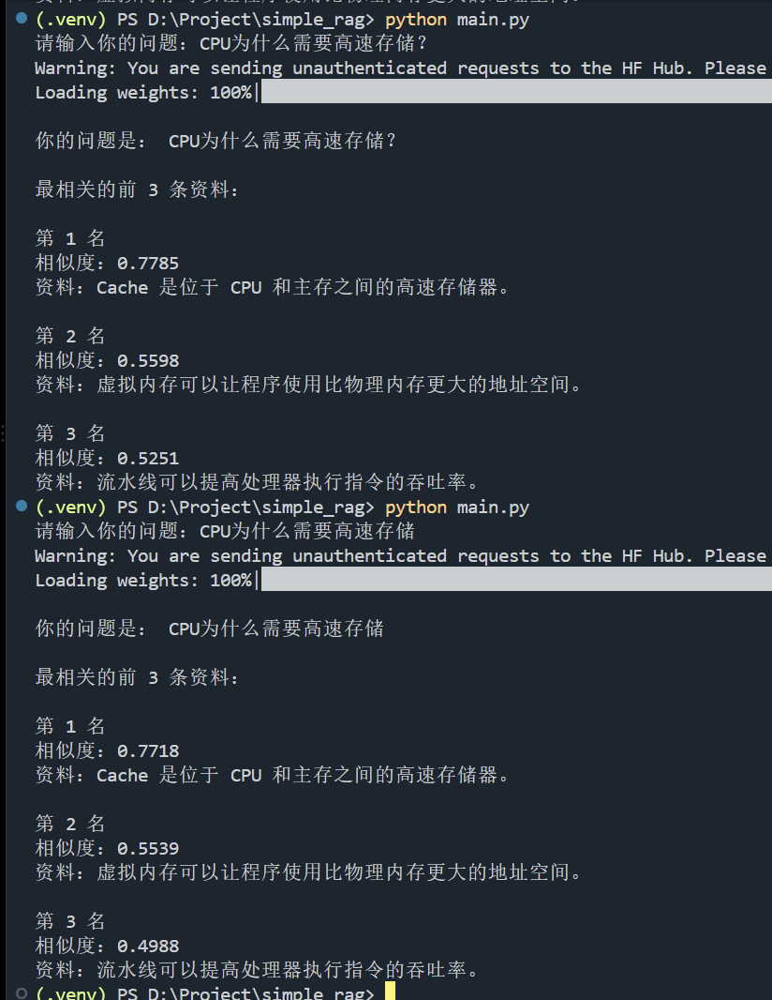
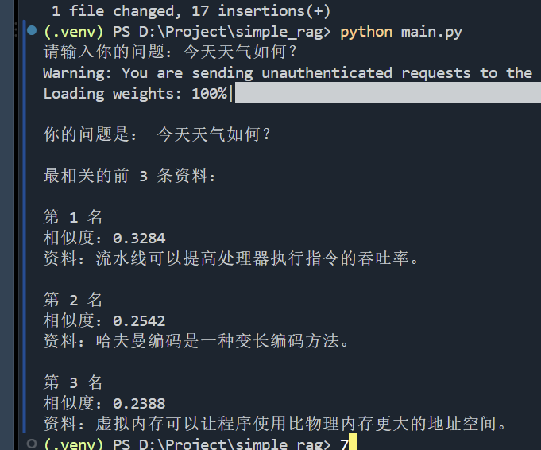

# 实验记录

## 2026-08-22 第一次语义检索

使用Embedding实现了简单的语义检索，但是第一次运行需要下载模型
程序每次启动时都需要加载Embedding模型，导致检索前存在一定启动延迟，检索时间较长，效率较低
后续可以考虑将模型长期驻留内存，避免每次请求都重新加载模型。

## 2026-08-22 Query表达方式实验

发现对同一个问题进行轻微改写，例如删除问号，会导致Embedding 相似度发生变化。

例如：

- `CPU为什么需要高速存储？`：0.7785
- `CPU为什么需要高速存储`：0.7718

虽然具体相似度发生变化，但 Top-K 排名基本保持一致。

初步推测：
标点和句式变化会改变模型的 token 序列和最终句向量，
因此会对相似度产生一定影响。

后续可继续测试不同问法对检索稳定性的影响。

##  2026-08-22 无关问题实验

支持Top-K语义检索后，发现若询问与资料无关联问题，程序仍会给出资料，后续需增加相似度阈值

## 2026-08-22 相似度阈值实验

目的：
研究是否可以通过设置相似度阈值，避免检索器在知识库没有答案时仍然返回无关内容。

当前暂时设置：threshold = 0.60

测试方法：
分别使用与知识库相关和无关的问题，观察 Top-1 相似度。

### 相关问题

| 问题 | Top-1 相似度 |
|---|---|
| CPU为什么需要高速存储？ | 0.7785 |
| 什么是精简指令集？ | 0.6994 |
| 怎样提高处理器吞吐率？ | 0.7036 |

### 无关问题

| 问题 | Top-1 相似度 |
|---|---|
| 今天天气如何？ | 0.3284 |
| 怎么做红烧肉？ | 0.2351 |
| 地球为什么绕太阳转？ | 0.3452 |

### 初步结论

相关问题：0.6994 ~ 0.7785

----------------

无关问题：0.2351 ~ 0.3452

在当前小规模测试中，相关问题与无关问题的 Top-1 相似度存在较明显间隔，因此暂时选择 0.60 作为阈值。但当前测试样本较少，该阈值不具有普适性，后续需要在更大的知识库和更多问题上继续验证。

## 2026-08-22 Chunk Size实验

问题：Cache利用了什么原理？

| chunk_size | overlap | Top-1 相似度 |
|---|---|---|
| 50 | 10 | 0.7640 |
| 120 | 30 | 0.7544 |
| 300 | 50 | 0.7310 |

目前试验的chunk_size与overlap较少且固定，有较大的局限性（视文本不同合适的参数也会不同）

## 2026-08-22 PDF页面过滤

测试时发现第一页主要包含文档说明和测试问题，会参与 Embedding 并影响 Top-K 检索结果。

因此当前版本跳过第一页，只对正文页面建立索引。

这说明在真实 RAG 系统中，PDF 解析后还需要进行页面过滤和文本清洗，避免封面、目录等非正文内容干扰检索结果。
